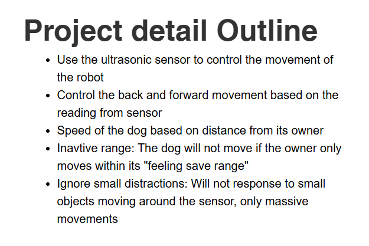
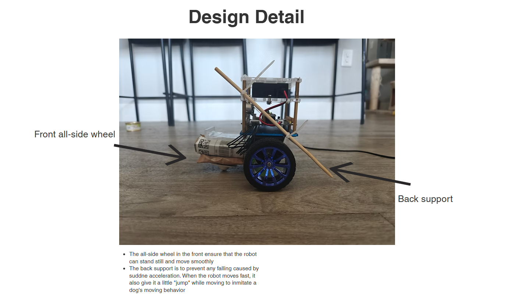
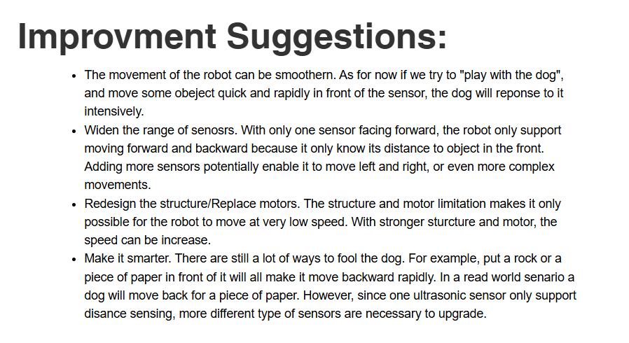

# Robot_dog

Test1_Ultrasonic: The original code that enables movements based on the sensor reading

Test1_Ultrasonic_Lv2: A little upgrade based on the original code. It will now adjust its speed based on the distance

Customizing the code:

design the size of the safe range or the ideal distance to stop:
To design the range of distance that the dog will stay inactive, change the target_distance in terms of ultrasonic sensor units

design the rate of speed:
Change line 459 and 466, adjust the denominator and velocity gain

